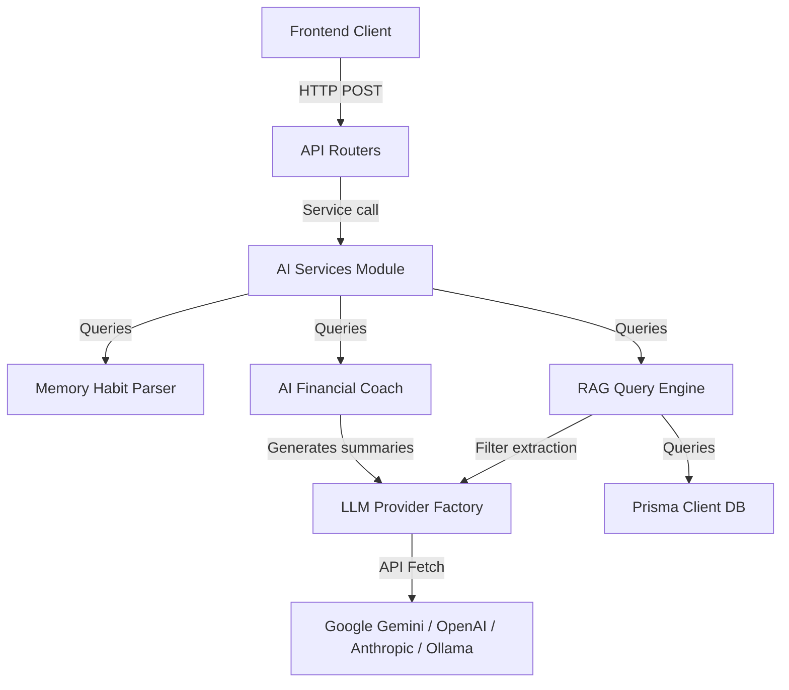

# AI Architecture Wiki

Last Updated: 2026-07-19

This wiki page outlines the engineering structure, modular design, and data flows of the artificial intelligence subsystem in the Expense Tracker.

---

## 🏗️ Architecture Overview

The AI layer is structured as an independent module located at [backend/src/services/ai/](file:///Users/supryo/Desktop/Expense-Tracker/backend/src/services/ai/). All UI components communicate exclusively with backend REST endpoints; frontend clients never invoke external LLM providers directly.

---

## 🔌 Modular Provider Abstraction (`provider.ts`)

LLM providers are abstracted through the `AIProvider` typing interface. Switching models is handled entirely via environment variables; no source-level changes are required.

### Supported Providers
*   **Google Gemini** (`AI_PROVIDER=gemini`): Connects to the official `@google/genai` client (using `gemini-2.5-flash` for multimodal receipt scans and chat completions).
*   **OpenAI** (`AI_PROVIDER=openai`): Connects to the ChatGPT Chat Completions endpoint (configurable model target: `gpt-4o-mini`).
*   **Anthropic** (`AI_PROVIDER=anthropic`): Queries Claude models (e.g. `claude-3-5-sonnet-20241022`).
*   **OpenRouter** (`AI_PROVIDER=openrouter`): Aggregates third-party models.
*   **Ollama** (`AI_PROVIDER=ollama`): Interfaces local server instances (e.g. `http://localhost:11434`) for full offline privacy.
*   **Offline Mock Engine** (Fallback): Triggered if credentials or keys are missing. Performs local calculations over user data to return high-fidelity mock summaries.

---

## 🔗 Related Resources
*   Read [[wiki/financial-assistant]] for Copilot chat services.
*   Read [[wiki/rag]] for information on Retrieval-Augmented Generation.
*   Read [[wiki/prompt-library]] for templates cataloging.
