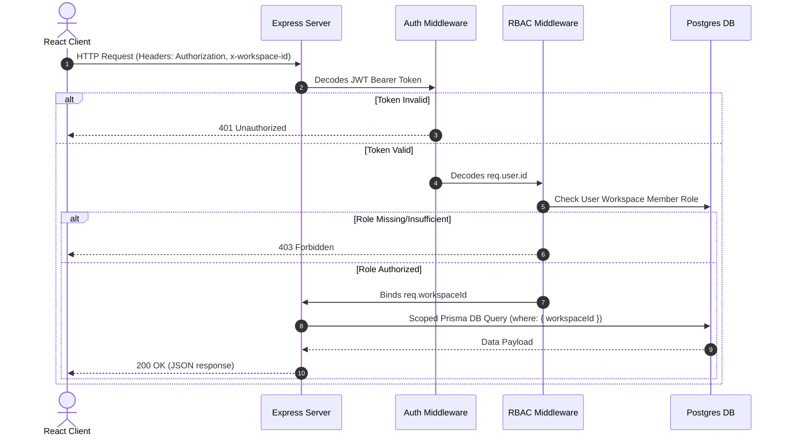
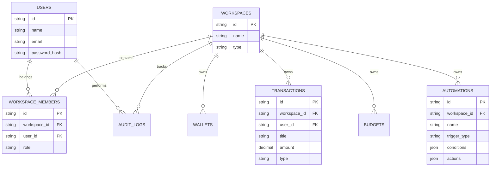
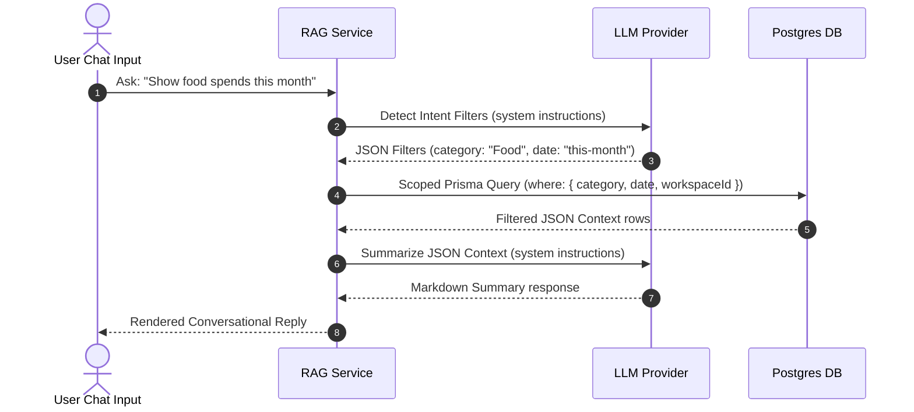

# Architecture & Sequence Diagrams

Last Updated: 2026-07-19

This wiki page contains Mermaid diagrams visualizing request flows, security scoping rules, and database entity relationships (ER).

---

## 🔒 Request Authentication & Scoping Flow

This sequence diagram details how incoming frontend requests are authenticated and scoped to workspaces using tokens and custom headers.

---

## 💾 Database Entity-Relationship (ER) Model

This diagram models the key relationships between Users, Workspaces, Transactions, Wallets, and Automations.

---

## 🤖 RAG Query Pipeline

Sequence flow representing the RAG Chat advisor fetching context securely:

