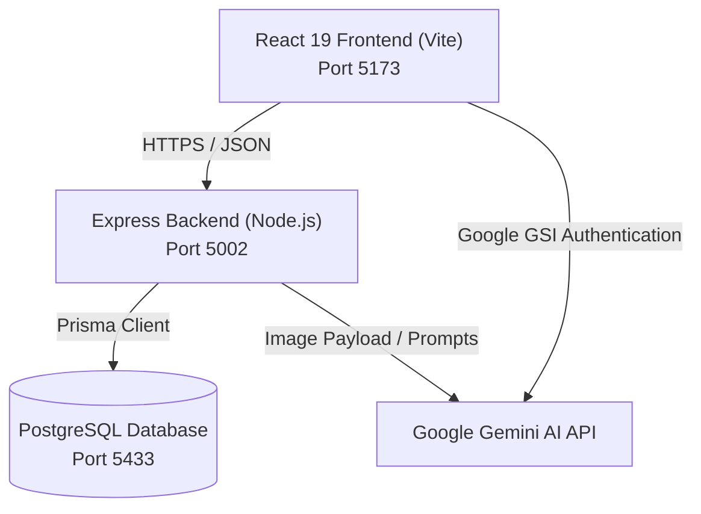

# System Architecture
Last Updated: 2026-07-19

This document details the high-level system components, networking configuration, and communication boundaries of the Personal Finance Tracker application.

---

## 🏗️ High-Level Topology

---

## 🌐 Component Specifications

### 1. Frontend Client SPA
* **Port**: `5173` (Vite dev server)
* **Access URL**: `http://localhost:5173`
* **Proxy Configuration**: Directs requests containing path `/api` to the backend socket at `http://localhost:5002/api`.

### 2. Backend REST API Server
* **Port**: `5002` (remapped from standard port `5000` to prevent collisions with macOS AirPlay services).
* **Access URL**: `http://localhost:5002`
* **CORS Policy**: Configured in `server.ts` to strictly allow origins defined in `CLIENT_URL` (defaulting to `http://localhost:5173`).

### 3. PostgreSQL Database
* **Port**: `5433` (configured to prevent collisions with default PostgreSQL port `5432`).
* **Socket Range**: Unix socket directory redirected to `/tmp` using repository-bound configuration inside `postgres_data/`.
* **Connector**: Prisma Client connection string is read from the backend environment file.

### 4. Third-Party Integrations
* **Google Identity Services (GSI)**: Handles authentication directly on the frontend, returning a JWT ID Token verified by the backend.
* **Google Gemini API**: Accessed from the backend utilizing `GEMINI_API_KEY` for OCR and chat completion.

---

## 🔒 Security Boundaries
1. **Frontend Isolation**: No direct database access; all communication goes through the Express REST API.
2. **API Verification Guard**: Middleware (`authenticate`) reads JWT Bearer headers on incoming requests, translating tokens to valid user identifiers.
3. **Database Scoping**: Database queries strictly filter records matching the authenticated user's ID (`userId: req.user.id`).

---

## 🔗 Related Resources
* Visit [[wiki/project-overview]] for system stacks.
* Visit [[wiki/frontend]] for client details.
* Visit [[wiki/backend]] for route logic.
